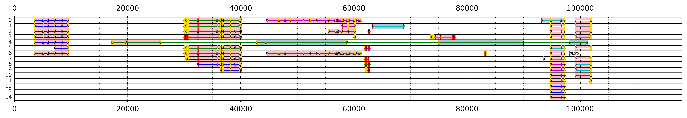

# Worked example

This guide walks through the main notebook, `lrRNAseq_TAST_visualiser.ipynb`, cell by cell, using the example data in this repository. For each step it says what you need to fill in, shows what the step produces on the example data, and, in the **How it works** boxes, explains the algorithm behind it.

The example data are long-read (PacBio CCS) RNAseq transcripts from several earthworm tissues, and `Ef318A10.fst`, a ~118 kb Bacterial Artificial Chromosome (BAC) containing an earthworm metallothionein gene. All numbers below come from running version 1.1 of the notebook on this data with the default settings and `BARCODE_LEN = 39`.

The same analysis is also available as a one-line command-line tool, [lrRNAseq-TAST_cli](https://github.com/Maxim-Karpov/lrRNAseq-TAST_cli), which gives identical results.

## Step 1 - Download lrRNAseq-TAST

Download the repository by clicking the green **<> Code** button on the main page of the repository, then **Download ZIP**, and extract the ZIP into a folder of your choice. Alternatively, with git:

```
git clone https://github.com/Maxim-Karpov/lrRNAseq-TAST.git
```

## Step 2 - Install Python and the required libraries

For new users the [Anaconda](https://www.anaconda.com/download) distribution is recommended. It contains Python, Jupyter Notebook, Pandas, NumPy and Matplotlib. The only other library needed is Biopython. Open a terminal (Linux/macOS) or the Anaconda Prompt (Windows) in the repository folder and run:

```
pip install -r requirements.txt
```

or, with conda:

```
conda install anaconda::biopython
```

Then open Jupyter Notebook (for example through Anaconda Navigator) and open `lrRNAseq_TAST_visualiser.ipynb`.

## Step 3 - Check all imports

Run the first cell. It imports the libraries and runs `bioinformatic_functions.ipynb`, which defines the functions used by the notebook. `bioinformatic_functions.ipynb` must be in the same folder as the visualiser notebook. If a library is missing, the cell will say which one; install it as in Step 2.

## Step 4 - Align the transcripts to the genomic region with BLAST

Install BLAST+ (for example `conda install bioconda::blast`), then make a BLAST database of the genomic sequence. In the folder containing `Ef318A10.fst`:

```
makeblastdb -in Ef318A10.fst -dbtype nucl -parse_seqids -out 318A10_db -title 318A10_db
```

Align the transcripts to it. The output format must be exactly `-outfmt '6 qseqid sseqid slen qlen qstart qend sstart send length mismatch gapopen pident evalue bitscore'`, with the transcripts as the query and the genomic region as the subject:

```
blastn -query all_transcripts.fasta -db 318A10_db -task blastn -word_size 4 -evalue 10 -max_hsps 10000 -num_threads 10 -out lrRNAseq_to_Ef318A10.out -outfmt '6 qseqid sseqid slen qlen qstart qend sstart send length mismatch gapopen pident evalue bitscore'
```

Choosing the alignment sensitivity:

- `-word_size 4 -evalue 10` gives the highest sensitivity and detects very short exons, but may take unreasonably long to run and produces many false positives. If such sensitivity is really needed, you can run BLAST for a manageable time (e.g. 10 minutes) and interrupt it; this still works if your transcripts of interest are not rare in the dataset.
- `-word_size 8` may be manageable to run to the end.
- `-word_size 12` or more can be used for exploration, to find transcripts whose exons are long and conserved and therefore align well. These transcripts can then be extracted and re-BLASTed with a smaller word size to obtain more accurate intron-exon junctions.

The BLAST result for the example, `lrRNAseq_to_Ef318A10.out`, is included in the repository, so you can skip this step to try the notebook.

## Step 5 - Import the BLAST alignments

Give the path to your BLAST result and run the cell:

```
TRANSCRIPT_TO_GENOME_BLAST_PATH = "./lrRNAseq_to_Ef318A10.out"
all_blast = read_blast(TRANSCRIPT_TO_GENOME_BLAST_PATH)
```

The example file contains 88,482 alignments of 17,988 transcripts. The `all_blast` table has one row per alignment (first rows shown, some columns omitted):

| qseqid | qlen | qstart | qend | sstart | send | pident | evalue | bitscore | sorientation |
|---|---|---|---|---|---|---|---|---|---|
| m64045e_240201_155513/11602711/ccs_gut | 1499 | 919 | 967 | 17304 | 17356 | 81.1 | 1.6e-07 | 50.9 | - |
| m64045e_240201_155513/11798740/ccs_cal_g | 5346 | 4357 | 4423 | 76327 | 76393 | 77.6 | 4.7e-08 | 54.5 | + |
| m64045e_240201_155513/13501296/ccs_gizz | 3278 | 2898 | 3036 | 92050 | 92197 | 71.8 | 1.3e-12 | 68.0 | - |

`q` columns are positions on the transcript (query) and `s` columns positions on the genome (subject).

> **How it works.** BLAST tables have no header line, so every line is read as an alignment. When a transcript aligns to the reverse strand of the genome, BLAST reports the genomic coordinates backwards (`sstart > send`). `read_blast()` records this in the `sorientation` column (`+` or `-`) and swaps the two coordinates, so that `sstart < send` for every alignment. This lets all later steps treat genomic intervals the same way. In the example, 42,852 of the 88,482 alignments (48%) are on the reverse strand. It also adds `q_mid` and `s_mid`, the midpoints of each alignment on the transcript and on the genome.

## Step 6 - Choose the alignment strand

```
STRAND_MODE = "dominant"
```

| Setting | Keeps |
|---|---|
| `"dominant"` (recommended) | for each transcript, only the alignments on the strand with the highest total bitscore |
| `"both"` | all alignments (behaviour of version 1.0) |
| `"plus"` / `"minus"` | only alignments on the forward / reverse strand of the genome |

With `"dominant"`, 55,671 of the 88,482 alignments are kept.

> **How it works.** A transcript can align to both strands: its gene on one strand, and short spurious or repeat hits on the other. Merging both into one gene model mixes sense and antisense hits and makes a transcript look longer and more fragmented than it is. For each transcript the cell adds up the bitscores of its `+` alignments and of its `-` alignments, and keeps only the strand with the larger total (ties go to `+`). The bitscore is used rather than the number of alignments because it reflects both alignment length and quality.

## Step 7 - Calculate transcript coverage and largest intron

Run the cell. For every transcript it calculates two values used to filter out false positives:

- **coverage** (`Tr_coverage`): the percentage of the transcript's length covered by its alignments;
- **largest intron** (`max_distance`): the largest gap on the genome between two of its alignments. All gaps are listed in `s_distances`.

For example, for transcript `m64045e_240201_155513/18875344/ccs_nerve_c` (1,320 bp long):

| qstart | qend | sstart | send |
|---|---|---|---|
| 118 | 290 | 3475 | 3652 |
| 290 | 401 | 4999 | 5110 |
| 399 | 508 | 5863 | 5972 |
| 509 | 608 | 7101 | 7200 |
| 617 | 695 | 8350 | 8428 |
| 693 | 930 | 9296 | 9532 |

its coverage is 60.8%, its gaps on the genome are 1347, 753, 1129, 1150 and 868 bp, and its largest intron is 1,347 bp.

> **How it works: merging overlapping intervals.** Alignments of the same transcript often overlap (above, 290-401 and 399-508 share two bases), and simply adding up their lengths would count the overlap twice. Both values are therefore calculated after merging overlapping intervals with a *sweep*:
>
> 1. sort the transcript's intervals by their start;
> 2. walk through them, keeping the largest end seen so far (the *running end*);
> 3. an interval that starts after the running end starts a new block; otherwise it is joined to the current block.
>
> Each block runs from the start of its first interval to the running end. This takes one pass after sorting, and `merge_intervals()` does it for all transcripts at once with grouped pandas operations rather than a Python loop (about 0.3 s for the 17,988 example transcripts).
>
> - For **coverage**, the intervals on the transcript (`qstart`-`qend`) are merged, and the summed block lengths are divided by the transcript length.
> - For the **largest intron**, the intervals on the genome (`sstart`-`send`) are merged, and the gap between consecutive blocks is the start of a block minus the end of the previous one. A transcript with a single block has a largest intron of 0.

## Step 8 - Sort the alignments along the genome

```
cov50 = all_blast.sort_values(["sstart", "qstart"], kind="stable").reset_index(drop=True)
```

Sorting by genomic position puts each transcript's alignments in genomic order, which the following steps rely on. Alignments that start at the same genomic position are ordered by their position on the transcript, so the order is always the same.

## Step 9 - Filter by largest intron and coverage

```
MAX_INTRON_LENGTH = 20000 #bp
cov50 = cov50[cov50["max_distance"]<MAX_INTRON_LENGTH]
```

removes transcripts whose alignments are spread so far apart that the gap is unlikely to be a real intron (17,988 → 10,043 transcripts), and

```
MIN_COVERAGE = 25 #percent
cov50 = cov50[cov50["Tr_coverage"]>MIN_COVERAGE]
```

removes transcripts of which only a small part aligned (10,043 → 56 transcripts).

These two filters remove most false positives. Adjust them based on your knowledge of the organism. For example, `MAX_INTRON_LENGTH = 7000` and `MIN_COVERAGE = 35` remove more than half of the remaining false positives in the example without losing any of the real genes, but they may remove genes that naturally have large introns.

## Step 10 - Save the filtered transcripts

Give a file name for the list of transcript IDs that passed the filters, and run the cell:

```
FILTERED_TRANSCRIPT_IDS = "./aligned_lrRNAseq_cov25_filtered.txt"
```

Then give the path to your complete transcript FASTA file and a name for a FASTA file of just the filtered transcripts, and run the next cell:

```
ALL_TRANSCRIPTS_PATH = "./all_transcripts.fasta"
FILTERED_TRANSCRIPTS_FASTA_PATH = "./filtered_transcripts.fasta"
```

The cell reads through the complete FASTA file once and writes out the records whose ID passed the filters (here, `56 of 56 filtered transcripts written`). It warns you if some IDs are missing from the FASTA file, and refuses to overwrite the input file if both paths are the same.

## Step 11 - Find open reading frames (ORFs)

If your transcripts still carry barcode sequences at both ends, give their length (39 bp for the example data):

```
BARCODE_LEN = 39
```

and run the cell. It trims the barcodes, converts the sequences to upper case, and calculates statistics for every transcript with `find_tr_ORF_stats()`. The resulting `all_stats` table has 51 columns, including GC content, stop codon counts, poly(A) tail position and length, translated protein sequences and metal response elements (MREs). The ones used for the plot are `ORF_coords` (the largest ORF) and `all_ORF_coords` (all ORFs). To see all columns, run `pd.set_option('display.max_columns', None)` and then `all_stats`.

> **How it works: ORF finding.** `find_ORFs()` looks at the three forward reading frames of the transcript (long-read transcripts are oriented 5'→3', so the reverse strand is not searched). In each frame it finds every `ATG` and extends it codon by codon to the first in-frame stop codon (`TAA`, `TAG` or `TGA`). Every `ATG` gives an ORF, so ORFs starting at internal `ATG`s of a longer ORF are included as well; an `ATG` with no downstream stop is ignored. ORFs of 26 nucleotides or shorter are discarded, and the longest remaining ORF becomes `ORF_coords`. Coordinates are 1-based and include the stop codon.
>
> For `m64045e_240201_155513/18875344/ccs_nerve_c`, 16 ORFs are found, for example (positions on the trimmed sequence) 208-351, 403-486, 460-486 (an internal `ATG` of the previous one) and 490-780. The longest is 138-785.

> **How it works: barcode correction.** ORFs are found on the trimmed sequences, but BLAST was run on the untrimmed ones, so the two use position numbers that differ by the barcode length. The cell compares each transcript's length in the BLAST file (`qlen`) with its trimmed length; half the difference is the offset to add to the ORF coordinates. In the example every transcript is 78 bp longer in the BLAST file, so all ORF coordinates are shifted by 39: the longest ORF above, 138-785 on the trimmed sequence, becomes 177-824 in BLAST coordinates. If BLAST was run on already-trimmed sequences, the offset is 0 and nothing is shifted. Lengths that differ by anything else produce a warning.

## Step 12 - Import the genomic sequence

```
GENOME_FASTA_PATH = "./Ef318A10.fst"
```

Run the cell. Only the sequence length (117,984 bp) is used, to set the extent of the plot.

## Step 13 - Combine alignments with ORFs and number the alignment regions

Run the cell. It builds `cov50_ranges`, a table with one row per transcript, containing its alignment regions on the genome (`srange`) and on the transcript (`qranges`), its genomic extent (`start`, `end`), its ORFs, and two new columns: which regions overlap an ORF (`qranges_in_ORF`, `qranges_in_largest_ORF`), and the region numbers drawn on the plot (`region_numbers`, `region_order`). Transcripts without an ORF are listed and left out of the plot.

> **How it works: which regions overlap an ORF.** A transcript's ORFs overlap each other heavily (nested ORFs from internal `ATG`s), so they are first merged into blocks with the same sweep as in Step 7. For the example transcript, its 16 ORFs become two blocks, 177-824 and 1049-1165. Each alignment region `[qstart, qend]` on the transcript is then tested against every block: two ranges overlap if the later of their two starts lies before the earlier of their two ends. All six regions of this transcript overlap the largest ORF, so all six are drawn with a gold fill on the plot.

> **How it works: region numbers.** The alignment regions of a transcript are numbered by their position in the transcript: the region whose `qstart` is smallest (nearest the 5' end) is 0, the next is 1, and so on. Regions with the same `qstart` (the same part of the transcript aligned in several places) share a number. The numbers are then read in genomic order:
>
> - `m64045e_240201_155513/18875344/ccs_nerve_c` has regions starting at transcript positions 118, 290, 399, 509, 617 and 693 at increasing genomic positions, so it reads `0 1 2 3 4 5`: a gene on the forward strand.
> - `m64045e_240201_155513/21497581/ccs_gut` has its region starting at transcript position 322 at genomic position 61,882, and its region starting at 121 further along at 62,480, so it reads `1 0`: a gene on the reverse strand, read along the genome from its 3' end to its 5' end.
> - `m64045e_240201_155513/16581017/ccs_cal_g` reads `5 7 8 6 2 0 4 1 9 3`: its pieces are scattered over ~60 kb in no consistent order, a sign of a rearrangement, a paralogous gene or repeats rather than a single gene.
>
> `region_order` summarises this as `forward`, `reverse`, `mixed` or `single` (only one region), using the colinear blocks described in Step 15. In the example, 45 transcripts are `forward`, 4 `reverse`, 2 `mixed` and 5 `single`. To list the unusual ones, run `cov50_ranges[cov50_ranges["region_order"] == "mixed"]`.

## Step 14 - Arrange the transcripts into plot rows

```
MIN_GAP = 0 #bp
```

Run the cell. Transcripts that do not overlap on the genome are placed in the same row of the plot, so that as few rows as possible are needed. `MIN_GAP` sets the minimum distance between neighbouring transcripts in a row; increase it if transcripts in a row are too close together to tell apart. The example's 56 transcripts are arranged in 15 rows.

> **How it works: greedy interval partitioning.** This is a classic scheduling problem (assigning lectures to the fewest lecture rooms), and a simple greedy algorithm solves it exactly:
>
> 1. sort the transcripts by their genomic start;
> 2. take them one at a time, and look at the row whose last transcript ends earliest;
> 3. if that transcript ends before the new one starts, put the new one in that row; otherwise open a new row.
>
> The rows are kept in a *heap* (a priority queue) ordered by where each row's last transcript ends, so finding the row that ends earliest takes very little time, and the whole arrangement takes O(*n* log *n*) time for *n* transcripts.
>
> Why is it optimal? A new row is opened only when every existing row is still occupied at the new transcript's start. At that position, the new transcript and the last transcript of every row all overlap, so any arrangement would need at least that many rows. The greedy method therefore never uses more rows than the largest number of transcripts overlapping at a single genomic position, which no arrangement can beat. In the example, at most 15 transcripts overlap at one position, and the plot has 15 rows.
>
> Version 1.0 searched combinations of transcripts instead, which took exponentially longer as the number of transcripts grew and so had to work in batches (`BATCH_SIZE`). The greedy method needs no batches and gives the most compact plot possible.

## Step 15 - Prepare the plotting data

The next cells (from `#combine transcript plot dataframe...` to `#finalising information`) convert the rows into what is drawn. There is nothing to fill in; run them in order. The result is `lrRNAseq_plot_df`, a table with one row per plot row. Its main columns are:

| Column | Contents |
|---|---|
| `TrNames` | the transcripts in the row, left to right |
| `range_per_tr` | the genomic extent of each transcript |
| `coord_ranges` | the genomic `[start, end]` of every alignment region in the row |
| `exon_synteny` | the region numbers of each transcript |
| `ORF_coords`, `all_ORF_coords` | the largest ORF and all ORFs of each transcript (transcript coordinates) |
| `syntenic_frames`, `frame_directions` | the colinear blocks and their direction (see below) |

> **How it works: row order.** Rows are sorted so that the widest rows (largest distance from the first to the last aligned base) are at the top. Rows of equal width are ordered by the total genomic extent of their transcripts, then by their start position, so the order is always the same.

> **How it works: the red blocks.** Each row's alignments are drawn as a filled outline. For each region `[s, e]` the cell adds the points `s - 1` and `e + 1` at height 0 and `s` and `e` at height 1. Sorted along the genome, these points trace a rectangle for every region, joined at height 0 in between.

> **How it works: number spacing.** Each region's number is placed at its centre. Where regions are closer than 250 bp, the numbers would overlap, so `space_elements()` walks along the row and moves each number to the right until it is at least 250 bp from the previous one.

> **How it works: colinear blocks.** `colinear_runs()` splits each transcript's region numbers, read along the genome, into *colinear blocks*: runs in which the numbers keep increasing (the transcript and the genome run in the same direction) or keep decreasing (they run in opposite directions). Starting from the left, a block takes the direction of its first step and grows while the numbers keep moving the same way; a step in the other direction, or a repeated number, starts a new block. Blocks are drawn as a pink background where the numbers increase, or the block is a single region, and blue where they decrease.
>
> - `0 1 2 3 4 5` is one forward block (pink): an intact gene on the forward strand.
> - `1 0` is one reverse block (blue): an intact gene on the reverse strand.
> - `5 7 8 6 2 0 4 1 9 3` splits into four blocks, `5 7 8`, `6 2 0`, `4 1` and `9 3`, showing that the transcript does not align as one colinear gene.
> - `6 0 1 2 3 4 5` (`m64045e_240201_155513/5113320/ccs_crop`) splits into `6 0` and `1 2 3 4 5`. Here all seven regions align to the same ~120 bp of the genome: the transcript contains a short repeated motif, so the blocks reflect a repeat rather than a gene structure.

## Step 16 - Plot

At the top of the plotting cell there are two settings:

```
ROW_NUMBERS = True #number the rows of the plot
PLOT_PATH = "./tast_plot.png" #leave empty ("") to only display the plot
```

Run the cell. The plot appears in the notebook, and is saved to `PLOT_PATH` if one is given (`.png`, `.pdf` or `.svg`; everything, including the axis numbers, fits in the saved picture). The plot is about 1 inch wide per 1.1 kb of genome (up to 50 inches) and 0.4 inches tall per row, so it can be large; you can also save it from the notebook by right-clicking the image.



Reading the plot:

- **Red blocks:** regions of the genome where a part of a transcript aligned.
- **Coloured lines:** the extent of each transcript; each transcript in a row has its own colour.
- **Gold outline:** the region overlaps one of the transcript's ORFs. **Gold fill:** it overlaps the largest ORF.
- **Numbers:** the position of each region in its transcript (Step 13).
- **Pink / blue background:** forward / reverse colinear blocks (Step 15).
- **Row numbers** (left): the index of the row in `lrRNAseq_plot_df`.

Many of the plotted alignments are still false positives, but the real alignments of transcripts to their genes stand out: short introns, compact exons at consistent positions, gold ORF regions, and several transcripts from different tissues supporting the same gene model. In the example, the loci at about 3-10 kb, 30-40 kb, 93-97 kb and 99-102 kb are each supported by 7 to 15 transcripts from several tissues.

## Step 17 - Find the transcripts of interest

Each row of the plot is the row of `lrRNAseq_plot_df` with the same number. For example, rows 0 to 3 all contain a transcript spanning 29,946-40,167 bp. To see the transcripts in row 0 and their extents:

```
lrRNAseq_plot_df.loc[0, ["TrNames", "range_per_tr"]]
```

The second transcript in the row, `m64045e_240201_155513/19859436/ccs_crop`, is the one at [29946, 40167]. The genomic positions of its alignment regions are in `coord_ranges`, and its ORFs in `ORF_coords` (largest) and `all_ORF_coords`.

You can also find all transcripts in a genomic range directly from `cov50_ranges`, for example those that lie within 25,000-45,000 bp:

```
of_interest = cov50_ranges[(cov50_ranges["start"] >= 25000) & (cov50_ranges["end"] <= 45000)]
of_interest[["qseqid", "start", "end", "region_numbers", "region_order", "ORF_coords"]]
```

and write them to a FASTA file:

```
ids = set(of_interest["qseqid"])
SeqIO.write((r for r in SeqIO.parse(ALL_TRANSCRIPTS_PATH, "fasta") if r.id in ids), "transcripts_25-45kb.fasta", "fasta")
```

You can then, for example, BLAST these transcripts against NCBI databases to find out which gene they come from.
